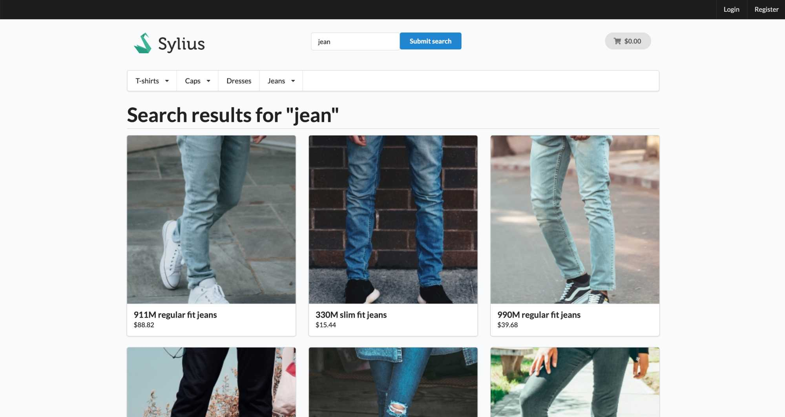
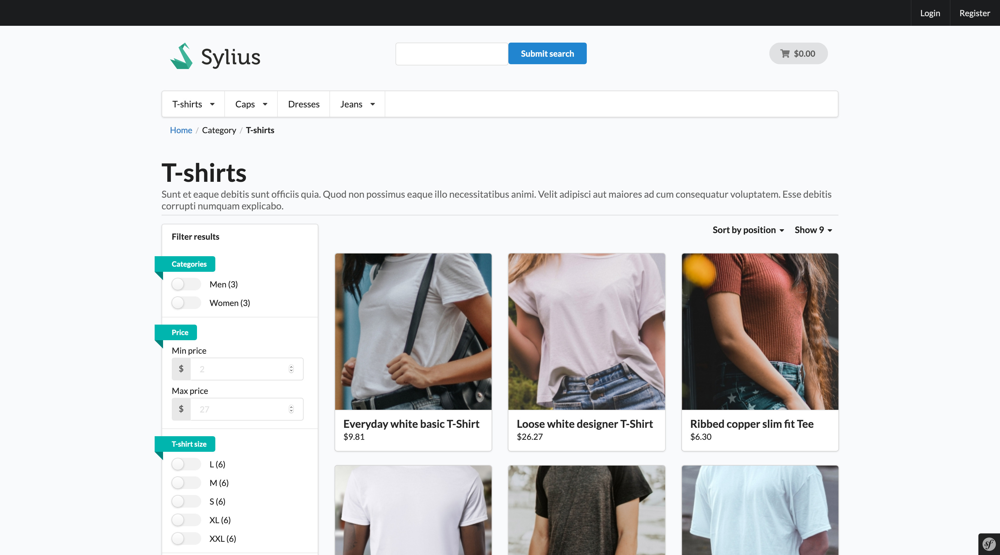
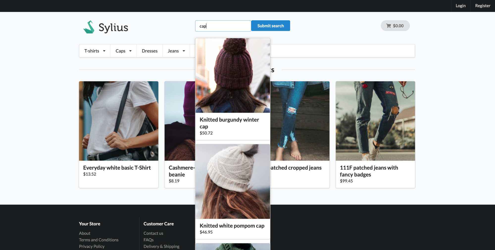

<p align="center">
    <a href="https://monsieurbiz.com" target="_blank">
        
    </a>
    &nbsp;&nbsp;&nbsp;&nbsp;
    <a href="https://monsieurbiz.com/agence-web-experte-sylius" target="_blank">
        
    </a>
    <br/>
    
</p>

<h1 align="center">Search</h1>

[](https://github.com/monsieurbiz/SyliusSearchPlugin/blob/master/LICENSE.txt)
[](https://github.com/monsieurbiz/SyliusSearchPlugin/actions?query=workflow%3A%22PHP+Composer%22)
[](https://scrutinizer-ci.com/g/monsieurbiz/SyliusSearchPlugin/?branch=master)

A search plugin for Sylius using [Jane](https://github.com/janephp/janephp) and [Elastically](https://github.com/jolicode/elastically).

## Features

### Search with filters, sort and limits



### Taxon view with filters, sort and limits




### Instant search while you're typing



## Installation

Require the plugin :  
`composer require monsieurbiz/sylius-search-plugin`

> If you are using Symfony Flex, the recipe will automatically do the actions below.

Then create the config file in `config/packages/monsieurbiz_search_plugin.yaml` with the [default configuration](#configuration).

Import routes in `config/routes.yaml` :
```yaml
monsieurbiz_search_plugin:
  resource: "@MonsieurBizSyliusSearchPlugin/Resources/config/routing.yaml"
```

Modify `config/bundles.php` to add this line at the end : 
```
    MonsieurBiz\SyliusSearchPlugin\MonsieurBizSyliusSearchPlugin::class => ['all' => true],
```

Finally configure plugin in your `.env` file by adding these lines at the end : 
```
###> MonsieurBizSearchPlugin ###
MONSIEURBIZ_SEARCHPLUGIN_ES_HOST=localhost
MONSIEURBIZ_SEARCHPLUGIN_ES_PORT=9200
###< MonsieurBizSearchPlugin ###
```

## Installation

1. Install Elasticsearch 💪. See [Infrastructure](#infrastructure) below.
2. Your `Product` entity needs to implement the [DocumentableInterface](#documentable-objects) interface and use the `\MonsieurBiz\SyliusSearchPlugin\Model\Documentable\DocumentableProductTrait` trait.

2. Your `ProductAttribute` and `ProductOption` entities need to implement the `\MonsieurBiz\SyliusSearchPlugin\Entity\Product\FilterableInterface` interface and use the `\MonsieurBiz\SyliusSearchPlugin\Model\Product\FilterableTrait` trait.

3. You need to run a diff of your doctrine's migrations: `console doctrine:migrations:diff`. Don't forget to run it! (`console doctrine:migrations:migrate`)

4. Copy the templates: (we update the `ProductAttribute` and `ProductOption` forms)

   ```bash
   mkdir -p templates/bundles/SyliusAdminBundle
   cp -Rv vendor/monsieurbiz/sylius-search-plugin/src/Resources/SyliusAdminBundle/views/ templates/bundles/SyliusAdminBundle/
   ```

5. Run the [populate command](#Command).

## Infrastructure

The plugin was developed for Elasticsearch 7.2.x versions. 
You need to have `analysis-icu` and `analysis-phonetic` elasticsearch plugin installed.

### Development 

Elasticsearch is available on `9200` port : http://127.0.0.1:9200/  
Cerebro on port `9000` : http://127.0.0.1:9000/#/overview?host=http:%2F%2Felasticsearch:9200  
Kibana on port `5601` : http://127.0.0.1:5601/ 

On your machine, Elasticsearch is available at http://127.0.0.1:9200/  
In docker, Elasticsearch is available at http://elasticsearch:9200/  
This is the second URL you have to put on Cerebro, Kibana and Elasticsearch if you want to connect to the cluster.  

For a development infrastructure with docker, you can check the [Monsieur Biz Sylius infra](https://github.com/monsieurbiz/sylius-infra/)

## Configuration

The default module configuration is : 

```yaml
imports:
    - { resource: "@MonsieurBizSyliusSearchPlugin/Resources/config/config.yaml" }

monsieur_biz_sylius_search:
    files:
        search: '%kernel.project_dir%/vendor/monsieurbiz/sylius-search-plugin/src/Resources/config/elasticsearch/queries/search.yaml'
        instant: '%kernel.project_dir%/vendor/monsieurbiz/sylius-search-plugin/src/Resources/config/elasticsearch/queries/instant.yaml'
        taxon: '%kernel.project_dir%/vendor/monsieurbiz/sylius-search-plugin/src/Resources/config/elasticsearch/queries/taxon.yaml'
    documentable_classes :
        - 'App\Entity\Product\Product'
    grid:
        limits:
            taxon: [9, 18, 27]
            search: [9, 18, 27]
        default_limit:
            taxon: 9
            search: 9
            instant: 10
        sorting:
            taxon: ['name', 'price', 'created_at']
            search: ['name', 'price', 'created_at']
        filters:
            apply_manually: false # Will refresh the filters depending on applied filters after you apply it manually
            use_main_taxon: true # Use main taxon for the taxon filter, else use the taxons

```

You can customize it in `config/packages/monsieurbiz_sylius_search_plugin.yaml`.

`monsieur_biz_sylius_search.files.search` is the query used to perform the search.  
`monsieur_biz_sylius_search.files.instant` is the query used to perform the instant search.  
`monsieur_biz_sylius_search.files.taxon` is the query used to perform the taxon view.

The `{{QUERY}}` string inside is replaced in PHP by the query typed by the user.

`documentable_classes` is an array of entities which can be indexed in Elasticsearch.

You can also change available sortings and limits.

You can decide to load filters before their application or after :
```yaml
monsieur_biz_sylius_search:
    grid:
        filters:
            apply_manually: false # Will refresh the filters depending on applied filters after you apply it manually
```

For example, if you choose a `L` size and the config is `true`, you will have only filters available for this size.  
You will also have a button to apply the desired filters : 


If it's set to false, you will have all available filters for the products and they will be applied on each change 
automatically.


You can decide to use the `Categories` filter with main taxon or taxons :
```yaml
monsieur_biz_sylius_search:
    grid:
        filters:
            use_main_taxon: true # Use main taxon for the taxon filter, else use the taxons
```

## Documentable objects

If you want to index an object in the search index, your entity have to implements `MonsieurBiz\SyliusSearchPlugin\Model\Documentable\DocumentableInterface` interface : 

```php
interface DocumentableInterface
{
    public function getDocumentType(): string;
    public function convertToDocument(string $locale): Result;
}
```

Here is an example for the product conversion using the plugin Trait to convert products : 

```php
<?php

declare(strict_types=1);

namespace App\Entity\Product;

use Doctrine\ORM\Mapping as ORM;
use MonsieurBiz\SyliusSearchPlugin\Model\Documentable\DocumentableProductTrait;
use MonsieurBiz\SyliusSearchPlugin\Model\Documentable\DocumentableInterface;
use Sylius\Component\Core\Model\Product as BaseProduct;
use Sylius\Component\Core\Model\ProductTranslation;
use Sylius\Component\Product\Model\ProductTranslationInterface;

/**
 * @ORM\MappedSuperclass
 * @ORM\Table(name="sylius_product")
 */
class Product extends BaseProduct implements DocumentableInterface
{
    use DocumentableProductTrait;

    protected function createTranslation(): ProductTranslationInterface
    {
        return new ProductTranslation();
    }
}
```

You can add everything you want !

## Score by attribute

Each document attribute can have a `score`. It means it can be more important than another.  
For example, the product name in the exemple above has a score of `50`, and the description a score of `10` : 
```php
$document->addAttribute('name', 'Name', [$this->getTranslation($locale)->getName()], $locale, 50);
$document->addAttribute('description', 'Description', [$this->getTranslation($locale)->getDescription()], $locale, 10);
```

## Improve search accuracy

You can customize the search with your custom query files and modifying : 

```yaml
monsieur_biz_sylius_search:
    files:
        search: '%kernel.project_dir%/vendor/monsieurbiz/sylius-search-plugin/src/Resources/config/elasticsearch/queries/search.yaml'
        instant: '%kernel.project_dir%/vendor/monsieurbiz/sylius-search-plugin/src/Resources/config/elasticsearch/queries/instant.yaml'
        taxon: '%kernel.project_dir%/vendor/monsieurbiz/sylius-search-plugin/src/Resources/config/elasticsearch/queries/taxon.yaml'
```

## Indexed Documents

Indexed documents are all entities defined in `monsieur_biz_search.documentable_classes` dans implements `DocumentableInterface`.

```yaml
monsieur_biz_sylius_search:
    documentable_classes :
        - 'App\Entity\Product\Product'
```

## Command

A symfony command is available to populate index : `console monsieurbiz:search:populate`

## Index on save

For product entity, we have a listener to add / update / delete document on save.
It is the `MonsieurBiz\SyliusSearchPlugin\EventListener\DocumentListener` class which : 
- `saveDocument` on `post_create` dans `post_update`
- `removeDocument` on `pre_delete`

If your entity implements `DocumentableInterface`, you can add listeners to manage entities modifications (Replace `<YOUR_ENTITY>` with your) :
```yaml
    app.event_listener.document_listener:
        class: MonsieurBiz\SyliusSearchPlugin\EventListener\DocumentListener
        arguments:
            - '@MonsieurBiz\SyliusSearchPlugin\Model\Document\Index\Indexer'
        tags:
            - { name: kernel.event_listener, event: sylius.<YOUR_ENTITY>.post_create, method: saveDocument }
            - { name: kernel.event_listener, event: sylius.<YOUR_ENTITY>.post_update, method: saveDocument }
            - { name: kernel.event_listener, event: sylius.<YOUR_ENTITY>.pre_delete, method: deleteDocument }
```

## Url Params

If you add a new entity in search index. You have to be able to generate an URL when you display it.  
In order to do that, you can customize the `RenderDocumentUrl` twig extension : 
```php
public function getUrlParams(Result $document): UrlParamsProvider {
    switch ($document->getType()) {
        case "product" :
            return new UrlParamsProvider('sylius_shop_product_show', ['slug' => $document->getSlug(), '_locale' => $document->getLocale()]);
            break;
            
        // Add new case !
    }
    
    throw new NotSupportedTypeException(sprintf('Object type "%s" not supported to get URL', $this->getType()));
}
```

## Display search form in front

A Twig method is available to display the form : `search_form()`. You can pass a parameter to specify a custom template.      
By default, the form is displayed on `sonata.block.event.sylius.shop.layout.header` event.

## Front customization

You can override all templates in your theme.

The bundle's templates are : 
- Search results display page (`src/MonsieurBizSearchPlugin/Resources/views/Search/`)
- Instant search display block (`src/MonsieurBizSearchPlugin/Resources/views/Instant/`)
- Taxon results display page (`src/MonsieurBizSearchPlugin/Resources/views/Taxon/`)
- Smaller components (`src/MonsieurBizSearchPlugin/Resources/views/Common/`)
- JS parameters (`src/MonsieurBizSearchPlugin/Resources/views/js.html.twig`)

Sylius documentation to customize these templates is available [here](https://docs.sylius.com/en/latest/customization/template.html).

## Jane

We are using [Jane](https://github.com/janephp/janephp) to create a DTO (Data-transfer object).  
Generated classes are on `src/MonsieurBizSearchPlugin/generated` folder.  
Jane configuration and JSON Schema are on `src/MonsieurBizSearchPlugin/Resources/config/jane` folder. 

To rebuild generated class during plugin development, we are using : 

```bash
symfony php vendor/bin/jane generate --config-file=src/Resources/config/jane/dto-config.php
```

## Elastically

The [Elastically](https://github.com/jolicode/elastically) Client is configured in `src/MonsieurBizSearchPlugin/Resources/config/services.yaml` file.  
You can customize it if you want in `config/services.yaml`.  
Analyzers and YAML mappings are on `src/MonsieurBizSearchPlugin/Resources/config/elasticsearch/mappings` folder.

You can also find YAML used by plugin to perform the search on Elasticsearch : 
- `src/MonsieurBizSearchPlugin/Resources/config/elasticsearch/queries/search.yaml`
- `src/MonsieurBizSearchPlugin/Resources/config/elasticsearch/queries/instant.yaml`
- `src/MonsieurBizSearchPlugin/Resources/config/elasticsearch/queries/taxon.yaml`

These queries can be customized in another folder if you change the plugin config.

## Fixtures

You can use fixtures to define filterable and non-filterable options and attributes : 

```yaml

sylius_fixtures:
    suites:
        default:
            fixtures:
                monsieurbiz_sylius_search_filterable:
                    options:
                        custom:
                            cap_collection:
                                attribute: 'cap_collection'
                                filterable: false

                            dress_collection:
                                attribute: 'dress_collection'
                                filterable: false

                            dress_height:
                                option: 'dress_height'
                                filterable: false

                            dress_size:
                                option: 'dress_size'
                                filterable: true
```
